# Ultra-Fast Attribute Swap - Minecraft Fabric Mod

A high-performance Minecraft Fabric mod for version 1.21.5 that performs ultra-fast attribute swapping during combat. When attacking with a sword, the mod automatically switches to a mace to apply its attributes for that single attack, then instantly switches back to the sword - all within the same game tick (≤1 tick total).

## ✨ Features

- **Ultra-Fast Swapping**: Completes entire attribute swap within ≤1 game tick
- **Wind Burst Priority**: Automatically prioritizes maces with Wind Burst enchantment
- **Seamless Experience**: Uses legitimate hotbar switching - no desync or visual glitches
- **Atomic Operations**: Appears atomic to both game engine and player
- **Real Input Handling**: Responds to actual attack inputs, not simulated ones
- **Network Safety**: Prevents desync between client and server

## 🎯 How It Works

1. **Attack Detection**: Monitors player attack input while holding a sword
2. **Instant Swap**: When attack is detected, instantly switches to best available mace
3. **Attribute Application**: Mace attributes (damage, enchantments) are applied to the attack
4. **Immediate Return**: Switches back to original sword slot within the same tick
5. **Zero Desync**: Uses proper network handling to maintain client-server sync

### Technical Details

- **Tick Performance**: Entire swap completes in ≤1 game tick (50ms at 20 TPS)
- **Input Validation**: Only triggers on actual attack input, not fake attacks
- **Slot Management**: Uses legitimate hotbar slot changes (no item NBT manipulation)
- **Network Safety**: Handles network packets to prevent desynchronization

## 🔧 Requirements

- Minecraft 1.21.5
- Fabric Loader 0.15.0+
- Fabric API
- Java 21+

## 📦 Installation

### Manual Build

1. Clone this repository:
   ```bash
   git clone https://github.com/rithzer016-lang/ultra-fast-attribute-swap.git
   cd ultra-fast-attribute-swap
   ```

2. Build the mod:
   ```bash
   ./gradlew build
   ```

3. Install the mod:
   - Copy the generated JAR file from `build/libs/` to your Minecraft `mods` folder
   - File will be named: `ultra-fast-attribute-swap-1.0.0.jar`

## 🎮 Usage

### Basic Usage

1. **Equip a sword** in your main hand
2. **Place a mace** in your hotbar (any slot 0-8)
3. **Attack an enemy** - the mod will automatically:
   - Switch to your mace
   - Apply mace attributes to the attack
   - Switch back to your sword instantly

### Optimal Setup

For best results:
- **Sword**: Any type (wooden, iron, diamond, netherite)
- **Mace**: Prioritizes maces with Wind Burst enchantment
- **Hotbar**: Keep mace in slots 1-8 (slot 0 works too)

### Example Hotbar Setup

```
Slot 1: Sword (main weapon)
Slot 2: Mace with Wind Burst (preferred)
Slot 3: Mace (backup)
Slots 4-9: Other items
```

## 🛠️ Configuration

Currently, the mod works with default settings. Future versions may include:
- Toggle for different weapons
- Custom keybindings
- Visual feedback options
- Performance settings

## 📊 Performance

- **Latency**: <1 game tick (50ms at 20 TPS)
- **Network**: No additional bandwidth usage
- **Server**: Compatible with vanilla servers (client-side only)
- **Ticks**: Zero tick delay between swap and return

## 🚫 Limitations

- Only works with swords → maces (specific weapon types)
- Requires mace to be in hotbar (not inventory)
- Client-side only (server will see normal weapon switching)
- May not work with some server anti-cheat plugins

## 🔍 Technical Architecture

### Core Components

1. **AttributeSwapHandler**: Main logic for swap timing and execution
2. **LocalPlayerMixin**: Hooks into player attack methods
3. **MinecraftMixin**: Captures attack input detection
4. **ClientPacketListenerMixin**: Prevents network desync

### Flow Diagram

```mermaid
sequenceDiagram
    participant P as Player
    participant M as Minecraft
    participant A as AttributeSwapHandler
    participant S as Server
    
    P->>M: Press Attack Key (with sword)
    M->>A: Detect attack input
    A->>A: Find best mace in hotbar
    A->>M: Switch to mace slot
    M->>S: Send attack packet (with mace)
    A->>M: Switch back to sword slot
    S->>M: Process attack with mace attributes
    M->>P: Show mace attack effects
    
    Note right of A: All within ≤1 tick
```



## 🐛 Troubleshooting

### Mod Not Working

1. **Check Minecraft version**: Must be 1.21.5
2. **Verify Fabric Loader**: Ensure Fabric is correctly installed
3. **Confirm item placement**: Mace must be in hotbar, not inventory
4. **Check logs**: Look for error messages in Minecraft logs

### Performance Issues

The mod is designed to be extremely lightweight. If you experience lag:
1. Check other installed mods
2. Ensure you have enough RAM allocated
3. Verify Java 21 is installed

### Server Compatibility

- Works on all vanilla servers
- Compatible with most Fabric servers
- May cause issues with anti-cheat plugins (use at your own risk)

## 📝 Version History

### v1.0.0 (Initial Release)
- Ultra-fast attribute swapping
- Wind Burst enchantment priority
- Seamless hotbar switching
- Network desync prevention
- Full tick-completion guarantee

## 🤝 Contributing

Contributions are welcome! Please feel free to submit a Pull Request.

### Development Setup

1. Set up a Minecraft modding environment
2. Clone this repository
3. Import as a Gradle project in your IDE
4. Run `./gradlew genSources` for Minecraft sources
5. Make your changes and test them
6. Submit a pull request

## 📄 License

This project is licensed under the MIT License - see the [LICENSE](LICENSE) file for details.

## 🙏 Acknowledgments

- **Fabric Team**: For the amazing modding framework
- **Minecraft Community**: For inspiration and feedback
- **1.21.5 Update**: Mace attribute system that made this possible

---

**⚠️ Disclaimer**: This mod modifies game behavior and may not be suitable for all servers. Always check server rules before using modifications.